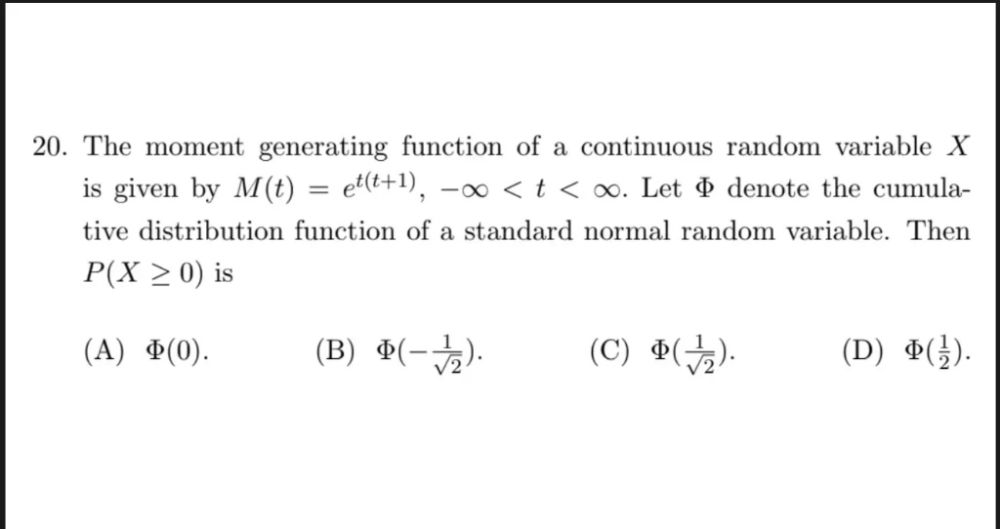

## Gemini Replied:

(C)  $\Phi \left(\frac{1}{\sqrt{2}}\right)$ 

* * *

### \## Explanation

This problem requires you to identify the probability distribution from its moment generating function (MGF) and then use that information to calculate the desired probability.

1.  **Identify the Distribution from the MGF** The MGF of a general normal random variable  $Y∼N\left(\mu ,\sigma ^{2}\right)$  is given by the standard formula:  $M_{Y}\left(t\right)=e^{\mu t+\frac{1}{2}\sigma ^{2}t^{2}}$ 
    
    We are given the MGF of  $X$  as:  $M\left(t\right)=e^{t\left(t+1\right)}=e^{t+t^{2}}$ 
    
    By comparing the exponents of the two forms, we can find the mean ( $\mu$ ) and variance ( $\sigma ^{2}$ ) of  $X$ :  $\mu t+\frac{1}{2}\sigma ^{2}t^{2}=t+t^{2}$ 
    
    *   Equating the coefficients of the  $t$  term:  $\mu =1$ 
        
    *   Equating the coefficients of the  $t^{2}$  term:  $\frac{1}{2}\sigma ^{2}=1⟹\sigma ^{2}=2$ 
        
    
    So,  $X$  is a normal random variable with a mean of 1 and a variance of 2, written as  $X∼N\left(1,2\right)$ .
    
2.  **Standardize the Random Variable** We need to find  $P\left(X\ge 0\right)$ . To use the standard normal CDF,  $\Phi$ , we must first standardize  $X$  into a standard normal variable  $Z∼N\left(0,1\right)$  using the formula:  $Z=\frac{X−\mu }{\sigma }$ 
    
    Here,  $\mu =1$  and the standard deviation is  $\sigma =\sqrt{\sigma ^{2}}=\sqrt{2}$ . We transform the inequality:  $X\ge 0$   $X−1\ge 0−1$   $\frac{X−1}{\sqrt{2}}\ge \frac{−1}{\sqrt{2}}$   $Z\ge −\frac{1}{\sqrt{2}}$ 
    
    Therefore,  $P\left(X\ge 0\right)$  is equivalent to  $P\left(Z\ge −\frac{1}{\sqrt{2}}\right)$ .
    
3.  **Use the Properties of the Standard Normal CDF ( $\Phi$ )** The function  $\Phi \left(z\right)$  gives the cumulative probability,  $P\left(Z\le z\right)$ . We need to find  $P\left(Z\ge a\right)$ , where  $a=−1/\sqrt{2}$ .
    
    First, use the complement rule:  $P\left(Z\ge a\right)=1−P\left(Z<a\right)=1−\Phi \left(a\right)$  So,  $P\left(Z\ge −\frac{1}{\sqrt{2}}\right)=1−\Phi \left(−\frac{1}{\sqrt{2}}\right)$ 
    
    Next, use the symmetry property of the standard normal distribution, which states that  $1−\Phi \left(−z\right)=\Phi \left(z\right)$ .
    
    Applying this property:  $1−\Phi \left(−\frac{1}{\sqrt{2}}\right)=\Phi \left(\frac{1}{\sqrt{2}}\right)$ 
    
    Thus, the correct answer is  $\Phi \left(\frac{1}{\sqrt{2}}\right)$ .

---

## You asked:

what is a moment generating function?

---

## Gemini Replied:

A **moment generating function (MGF)** is a mathematical "fingerprint" for a probability distribution. It's a function that uniquely encodes all the distribution's moments (like the mean, variance, skewness, etc.) into a single expression.

Think of it this way: just as a person has a unique fingerprint that contains all their identifying information, many probability distributions have a unique MGF that contains all their essential properties.

* * *

### \## What Does It Do? 🧬

The "generating" part of the name is literal. The MGF's main purpose is to **generate moments** through the simple process of taking derivatives.

The rule is: The  $n^{th}$  moment about the origin,  $E\left[X^{n}\right]$ , is the  $n^{th}$  derivative of the MGF evaluated at  $t=0$ .

*   **To find the Mean ( $E\left[X\right]$ ):**
    
    1.  Calculate the first derivative of the MGF,  $M^{′}\left(t\right)$ .
        
    2.  Set  $t=0$ . The result is the mean. ( $E\left[X\right]=M^{′}\left(0\right)$ )
        
*   **To find  $E\left[X^{2}\right]$ :**
    
    1.  Calculate the second derivative of the MGF,  $M^{′′}\left(t\right)$ .
        
    2.  Set  $t=0$ . The result is  $E\left[X^{2}\right]$ . ( $E\left[X^{2}\right]=M^{′′}\left(0\right)$ )
        

You can then easily find the **Variance** using the familiar formula:  $Var\left(X\right)=E\left[X^{2}\right]−\left(E\left[X\right]\right)^{2}$ .

* * *

### \## The Formal Definition ⚙️

The MGF of a random variable  $X$ , denoted  $M_{X}\left(t\right)$ , is defined as the **expected value of  $e^{tX}$ **:

 $M_{X}\left(t\right)=E\left[e^{tX}\right]$ 

*   For a **discrete** random variable:  $M_{X}\left(t\right)=\sum_{x} e^{tx}P\left(X=x\right)$ 
    
*   For a **continuous** random variable:  $M_{X}\left(t\right)=\int_{−∞}^{∞} e^{tx}f\left(x\right)dx$ 
    

You don't always need to calculate this integral or sum yourself; MGFs for common distributions (like the Normal, Poisson, etc.) are well-known formulas.

* * *

### \## Why Is It Important? 💡

MGFs are a powerful tool in probability and statistics for a few key reasons:

1.  **Easier Moment Calculation:** Finding moments by taking derivatives is often much simpler than calculating them directly with integrals or complex sums.
    
2.  **Identifying Distributions:** This is its "fingerprint" property. If you can show that two random variables have the same MGF, you have proven they follow the exact same distribution. This is the technique you used in the previous problem to identify the  $N\left(1,2\right)$  distribution.
    
3.  **Sums of Independent Variables:** The MGF of a sum of independent random variables is simply the **product** of their individual MGFs. This is an incredibly useful property that turns a very difficult calculation (called a convolution) into simple multiplication.

---

