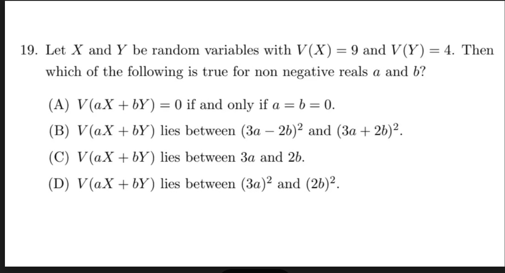

## Gemini Replied:

(B)  $V\left(aX+bY\right)$  lies between  $\left(3a−2b\right)^{2}$  and  $\left(3a+2b\right)^{2}$ .

* * *

### \## Explanation

Here's the step-by-step derivation to find the correct range for the variance.

1.  **Recall the General Formula for Variance** The variance of a linear combination of two random variables  $X$  and  $Y$  is given by:  $V\left(aX+bY\right)=a^{2}V\left(X\right)+b^{2}V\left(Y\right)+2ab\cdot Cov\left(X,Y\right)$ 
    
2.  **Substitute Given Values** We are given  $V\left(X\right)=9$  and  $V\left(Y\right)=4$ . Plugging these in, we get:  $V\left(aX+bY\right)=a^{2}\left(9\right)+b^{2}\left(4\right)+2ab\cdot Cov\left(X,Y\right)$   $V\left(aX+bY\right)=9a^{2}+4b^{2}+2ab\cdot Cov\left(X,Y\right)$ 
    
3.  **Consider the Covariance Term** The covariance,  $Cov\left(X,Y\right)$ , is related to the correlation coefficient,  $\rho$ , by the formula:  $Cov\left(X,Y\right)=\rho \cdot \sigma _{X}\cdot \sigma _{Y}$  where  $\sigma _{X}$  and  $\sigma _{Y}$  are the standard deviations.
    
    *    $\sigma _{X}=\sqrt{V\left(X\right)}=\sqrt{9}=3$ 
        
    *    $\sigma _{Y}=\sqrt{V\left(Y\right)}=\sqrt{4}=2$ 
        
    
    So,  $Cov\left(X,Y\right)=\rho \cdot 3\cdot 2=6\rho$ .
    
    The key property here is that the correlation coefficient  $\rho$  must always be in the range  $\left[−1,1\right]$ . This means the covariance  $Cov\left(X,Y\right)$  must be in the range  $\left[−6,6\right]$ .
    
4.  **Find the Minimum and Maximum Possible Variance** Now we can substitute the expression for covariance back into our variance formula:  $V\left(aX+bY\right)=9a^{2}+4b^{2}+2ab\left(6\rho \right)=9a^{2}+4b^{2}+12ab\rho$ 
    
    To find the bounds for the variance, we need to consider the extreme values of  $\rho$ .
    
    *   **Maximum Variance (when  $\rho =1$ ):** This occurs when  $X$  and  $Y$  are perfectly positively correlated.  $V_{max}=9a^{2}+4b^{2}+12ab\left(1\right)=9a^{2}+12ab+4b^{2}$  This expression is a perfect square: ** $\left(3a+2b\right)^{2}$ **.
        
    *   **Minimum Variance (when  $\rho =−1$ ):** This occurs when  $X$  and  $Y$  are perfectly negatively correlated.  $V_{min}=9a^{2}+4b^{2}+12ab\left(−1\right)=9a^{2}−12ab+4b^{2}$  This expression is also a perfect square:  $\left(3a−2b\right)^{2}$ .
        
5.  **Conclusion** The variance  $V\left(aX+bY\right)$  must lie between these minimum and maximum possible values. Therefore, the correct statement is: $\left(3a−2b\right)^{2}\le V\left(aX+bY\right)\le \left(3a+2b\right)^{2}$

---

## You asked:

is variance a positive or negative value or can it take any real value? also tell me the intuitive behind the general formula you used $V(aX+bY)=a2V(X)+b2V(Y)+2ab⋅Cov(X,Y)$

---

## Gemini Replied:

Variance is always a **non-negative** value (zero or positive).

It can never be negative because it's calculated by averaging the _squared_ differences of each data point from the mean. Since the square of any real number (positive or negative) is always non-negative, their average must also be non-negative. A variance of zero means all the data points are identical.

* * *

### \## Intuition Behind the Formula

Let's break down the formula for the variance of a combined variable,  $Z=aX+bY$ :

 $V\left(Z\right)=V\left(aX+bY\right)=a^{2}V\left(X\right)+b^{2}V\left(Y\right)+2ab\cdot Cov\left(X,Y\right)$ 

Think of this formula like an equation for the "total wobble" of a system made of two wobbly parts,  $X$  and  $Y$ .

### \## 1. The Individual Wobbles:  $a^{2}V\left(X\right)$  and  $b^{2}V\left(Y\right)$ 

*   ** $V\left(X\right)$  and  $V\left(Y\right)$ :** These are the inherent "wobbles" or variabilities of parts  $X$  and  $Y$  on their own.
    
*   **Why the square ( $a^{2}$ )?** Variance is measured in squared units (like meters squared if your data is in meters). When you scale your variable by a factor of  $a$ , you are stretching its spread. This stretching effect on the variance is quadratic. For example, doubling a variable's values ( $a=2$ ) quadruples ( $a^{2}=4$ ) its variance because the deviations from the mean are all doubled, and then you square those doubled deviations.
    

So, the first two terms,  $a^{2}V\left(X\right)$  and  $b^{2}V\left(Y\right)$ , represent the scaled-up wobbles of each part, considered in isolation.

### \## 2. The Interaction Term:  $2ab\cdot Cov\left(X,Y\right)$ 

This is the most crucial part. It accounts for how the two parts wobble _together_. **Covariance ( $Cov\left(X,Y\right)$ )** measures the direction of the relationship between  $X$  and  $Y$ .

*   **Positive Covariance ( $Cov\left(X,Y\right)>0$ ):** This means when  $X$  tends to be above its average,  $Y$  also tends to be above its average. They move in the same direction. This is like two people pushing a car in the same direction—their efforts combine to create a much bigger total effect. This term **adds** to the total variance, making the combined system _more_ volatile than the sum of its parts. It's constructive interference.
    
*   **Negative Covariance ( $Cov\left(X,Y\right)<0$ ):** This means when  $X$  tends to be above its average,  $Y$  tends to be _below_ its average. They move in opposite directions. This is like one person pushing a car forward while another pushes it backward—their efforts partially cancel out. This term **subtracts** from the total variance, making the combined system _less_ volatile. This is the core idea behind diversification in finance: combining assets that move in opposite directions to reduce the total risk (variance). It's destructive interference.
    
*   **Zero Covariance ( $Cov\left(X,Y\right)=0$ ):** This means there's no linear relationship between how  $X$  and  $Y$  move. Their wobbles are unrelated (if they are independent, their covariance is zero). In this case, the interaction term vanishes, and the total variance is just the sum of the individual scaled variances:  $V\left(aX+bY\right)=a^{2}V\left(X\right)+b^{2}V\left(Y\right)$ .
    

The factor of ** $2ab$ ** is there because the interaction between  $X$  and  $Y$  happens in two ways: how  $aX$  influences  $bY$  and how  $bY$  influences  $aX$ , mirroring the expansion of  $\left(a+b\right)^{2}=a^{2}+b^{2}+2ab$ .

---

