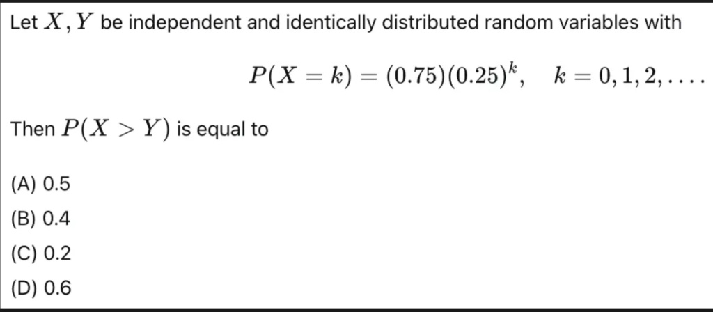

## You asked:

what does independently and identically distributed random variable mean and why is it significant?

---

## Gemini Replied:

Independently and Identically Distributed (I.I.D.) is a foundational assumption in statistics and machine learning. It means that each random variable in a sequence comes from the **same probability distribution** and is **mutually independent** of the others.

Let's break that down with an analogy: imagine you're repeatedly flipping a fair coin.

* * *

### \## 1. Independent 🎲

**Independence** means the outcome of one event tells you nothing about the outcome of the next.

*   **Coin Analogy:** If you flip a coin and get "Heads," the probability of the next flip being "Heads" is still exactly 50%. The first flip has no memory and exerts no influence on the second. Each flip is a self-contained event.
    
*   **The Opposite (Dependent):** Imagine drawing cards from a deck _without replacement_. If you draw an Ace first, the probability of the second card being an Ace is lower because there are fewer Aces left. The events are dependent.
    

### \## 2. Identically Distributed 📜

**Identically Distributed** means that every event in the sequence is drawn from the same underlying probability distribution. The "rules" of the game don't change.

*   **Coin Analogy:** For every flip, you're using the _exact same coin_. The probability of getting "Heads" is always 0.5, and the probability of "Tails" is always 0.5. You're not secretly swapping in a biased coin for the third flip.
    
*   **The Opposite (Not Identically Distributed):** Imagine a factory where a machine's performance degrades over the day. The probability of it producing a defective part is higher at 5 PM than at 9 AM. Data points collected throughout the day would not be identically distributed.
    

So, a sequence of fair coin flips is a perfect example of an **I.I.D.** process: each flip is **independent** of the last, and the probability distribution (50% Heads, 50% Tails) is **identical** for every flip.

* * *

### \## Why is the I.I.D. Assumption So Significant? 🧠

The I.I.D. assumption is a cornerstone of statistics and machine learning because it **dramatically simplifies the mathematics** and allows us to make powerful inferences from data.

1.  **It Enables Key Theoretical Results:** Two of the most important theorems in all of statistics are built on the I.I.D. assumption:
    
    *   **The Law of Large Numbers (LLN):** This theorem states that as you collect more I.I.D. samples, the average of your samples will converge to the true average (the expected value) of the underlying distribution. This is the mathematical reason why **larger samples give you more reliable estimates**.
        
    *   **The Central Limit Theorem (CLT):** This remarkable theorem says that if you take a large number of I.I.D. samples, the distribution of their _average_ will be approximately a normal distribution (a bell curve), **even if the original data's distribution wasn't a bell curve**. This is why the normal distribution is so common and powerful in statistics.
        
2.  **It's the Foundation of Machine Learning:** In ML, we typically assume that our training data is a set of I.I.D. samples from some unknown distribution.
    
    *   **Generalization:** This assumption allows us to believe that a model learned on the training set will also perform well on new, unseen data (the test set), because we assume the test set is drawn from the same distribution.
        
    *   **When it Fails:** Recognizing when data is _not_ I.I.D. is also crucial. For example, in **time-series data** (like stock prices), each observation is dependent on the previous one. In these cases, we must use specialized models (like RNNs or LSTMs) that are designed to handle non-I.I.D. data.

---

## Gemini Replied:

(C) 0.2

The key to solving this problem efficiently is to use the fact that the random variables  $X$  and  $Y$  are **independent and identically distributed (I.I.D.)**.

* * *

### \## Explanation

Since  $X$  and  $Y$  are drawn from the exact same probability distribution and are independent, there's a perfect symmetry between them. This means there's no reason to believe that one is inherently more likely to be larger than the other.

1.  **Three Possible Outcomes** When comparing  $X$  and  $Y$ , there are three mutually exclusive possibilities:
    
    *    $X>Y$ 
        
    *    $Y>X$ 
        
    *    $X=Y$ 
        
    
    The sum of their probabilities must equal 1:  $P\left(X>Y\right)+P\left(Y>X\right)+P\left(X=Y\right)=1$ 
    
2.  **Using the Symmetry Argument** Because  $X$  and  $Y$  are identically distributed, the probability that  $X$  is greater than  $Y$  must be the same as the probability that  $Y$  is greater than  $X$ .  $P\left(X>Y\right)=P\left(Y>X\right)$ 
    
    Let's call this probability  $p$ . Our equation from Step 1 now becomes:  $p+p+P\left(X=Y\right)=1⟹2p+P\left(X=Y\right)=1$ 
    
3.  **Calculate  $P\left(X=Y\right)$ ** The only part we need to calculate is the probability that  $X$  and  $Y$  are equal. This happens if both variables take on the same value  $k$ , for any possible  $k$ .  $P\left(X=Y\right)=\sum_{k=0}^{∞} P\left(X=k and Y=k\right)$ 
    
    Since  $X$  and  $Y$  are **independent**, we can multiply their probabilities:  $P\left(X=Y\right)=\sum_{k=0}^{∞} P\left(X=k\right)\cdot P\left(Y=k\right)$ 
    
    Since they are **identically distributed**,  $P\left(X=k\right)=P\left(Y=k\right)$ .  $P\left(X=Y\right)=\sum_{k=0}^{∞} \left[P\left(X=k\right)\right]^{2}=\sum_{k=0}^{∞} \left[\left(0.75\right)\left(0.25\right)^{k}\right]^{2}$   $P\left(X=Y\right)=\sum_{k=0}^{∞} \left(0.75\right)^{2}\cdot \left(0.25\right)^{2k}=\left(0.75\right)^{2}\sum_{k=0}^{∞} \left(0.0625\right)^{k}$ 
    
    This is a geometric series  $\sum_{k=0}^{∞} r^{k}$  with  $r=0.0625$ . The sum is  $\frac{1}{1−r}$ .  $P\left(X=Y\right)=\left(0.75\right)^{2}\cdot \frac{1}{1−0.0625}=\left(0.5625\right)\cdot \frac{1}{0.9375}$   $P\left(X=Y\right)=\frac{9}{16}\cdot \frac{1}{15/16}=\frac{9}{16}\cdot \frac{16}{15}=\frac{9}{15}=\frac{3}{5}=0.6$ 
    
4.  **Solve for  $p$ ** Now we plug this result back into our equation from Step 2:  $2p+0.6=1$   $2p=0.4$   $p=0.2$ 
    

Therefore,  $P\left(X>Y\right)$  is equal to **0.2**.

---

## You asked:

why is there no reason to believe that one is inherently more likely to be larger than the other.

---

## You asked:

can you explain it again with more simplicity for a beginner who has not developed advanced mathematical rigor

---

## Gemini Replied:

Of course. Let's forget the math jargon and think about it as a simple, fair game.

The core idea is **perfect fairness**.

* * *

### \## The Dice Game Analogy 🎲

Imagine you and a friend decide to play a game. The rules are simple:

1.  You each get one standard, fair, six-sided die.
    
2.  You both roll your die at the same time.
    
3.  Whoever rolls the higher number wins.
    

Now, before you roll, ask yourself: **Who is more likely to win?**

You'll quickly realize that neither of you has an advantage. The game is perfectly balanced for two key reasons:

1.  **You're using the same kind of equipment.** Both dice are identical—they're fair and have six sides. This is what **"identically distributed"** means. The "rules" (the probabilities of rolling a 1, 2, 3, 4, 5, or 6) are the same for both of you. It's not like you have a regular die and your friend has a die with only high numbers.
    
2.  **Your actions don't affect each other.** Your roll has no influence on your friend's roll, and vice-versa. This is what **"independent"** means.
    

* * *

### \## The Conclusion of Fairness

Because the game is perfectly fair and balanced, the probability that **your score is higher than your friend's score** is the exact same as the probability that **your friend's score is higher than yours**.

That's it. That's the whole intuition.

When we use the letters  $X$  and  $Y$  in the problem, think of them as "Your Score" ( $X$ ) and "Your Friend's Score" ( $Y$ ). The mathematical statement  $P\left(X>Y\right)=P\left(Y>X\right)$  is just a formal way of saying that both players in a perfectly fair game have an equal chance of winning.

---

